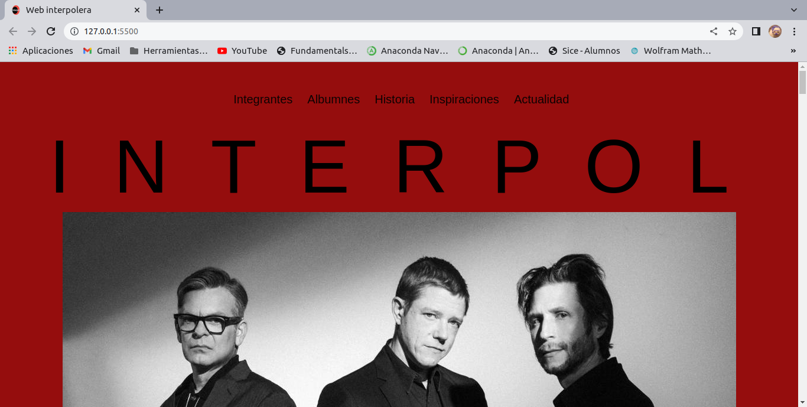
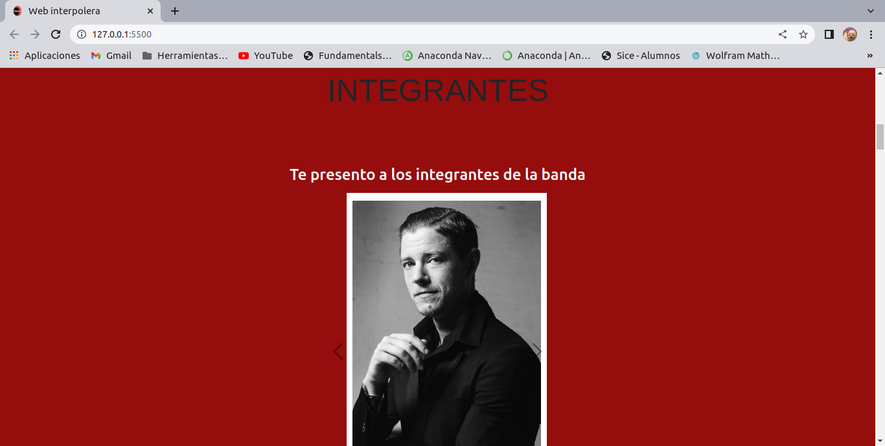
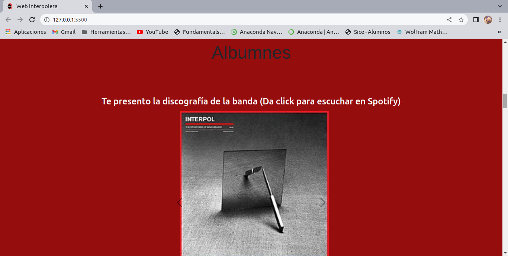
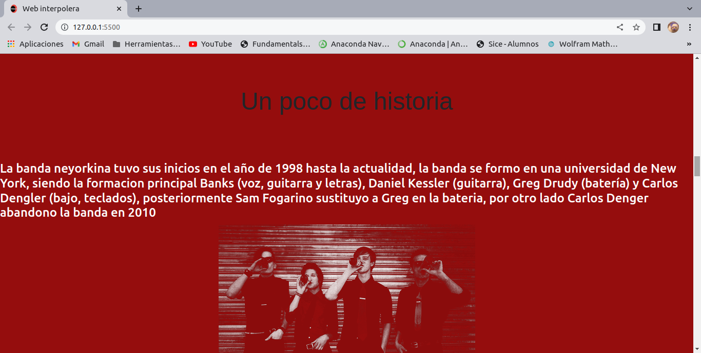
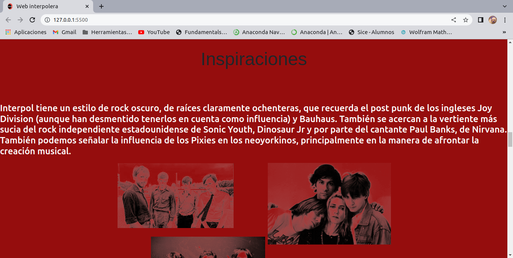
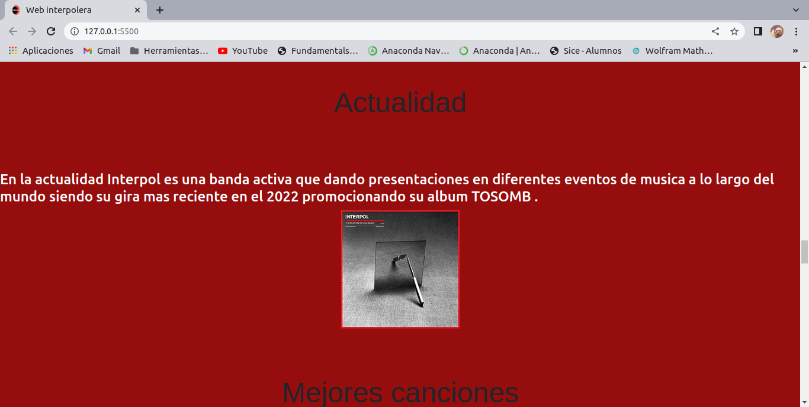
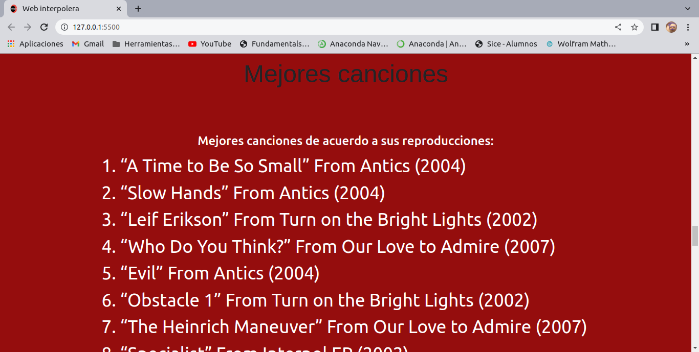

#Pagina web:

Este proyecto fue creado duranto el curso de Technolochicas PRO, se trata de una pagina web con tema a elección, si bien no tiene un diseño "responsive" se aplicaron los conocimientos adquiridos durante el curso, como la creación de barra de navegación, incluir imagenes y modificar su tamaño, incluir links externos e internos, y la creación de formularios del tipo "radio" y "checkbox".

### Capturas de pantalla:

Primera parte de la página web:

Seccion de integrantes de la banda (formato carrusel)

Seccion de albumnes con acceso directo a spotify (formato carrusel)

Secciones de historia, inspiraciones y actualidad (con su propio acceso directo desde la barra de navegación)

Lista de mejores canciones

Formulario radio

Formulario checkbox

## Tecnologías

Esta página web fue creada con:

* HTML
* CSS 
* Bootstrap 5

Además, se incluyeron **Google Fonts** para personalizar la fuente y **Bootstrap icons** para incorporar íconos como flechas.

## Español

El texto de la página web está escrito en español, al igual que las clases y atributos personalizados. Las clases relacionadas con Bootstrap se incluyeron en inglés.

